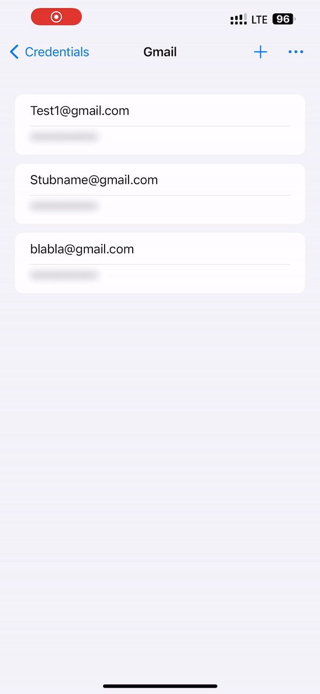
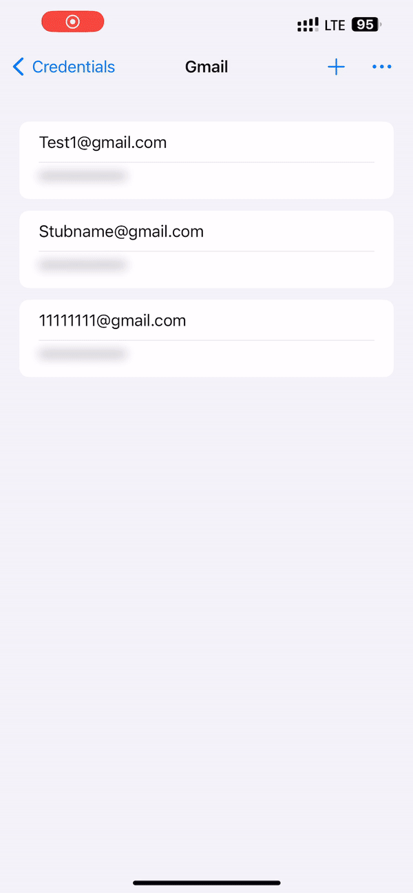

# PassMan - A Swift/SwiftUI Password Manager

PassMan is a simple and secure password manager designed to store your credentials safely using encryption. Built using Swift and SwiftUI, it leverages strong encryption to ensure that sensitive information like resource names, usernames, and passwords are protected.

  
  
  

## Features

- **Master Key Encryption**: All credentials are encrypted with a master key derived from the user's master password. The key is never stored unless Face ID authentication is enabled, in which case it's securely stored in the iOS Keychain.
- **Face ID Authentication**: Support for Face ID allows quick and secure access to your credentials. When Face ID is enabled, the master key is securely stored in the Keychain for convenience.
- **Add, Edit, and Delete Credentials**: Manage your credentials with ease—add new entries, edit existing ones, or delete them when no longer needed.
- **Password Strength Indicator**: When adding new entries, PassMan includes a real-time password strength indicator based on entropy, giving users immediate feedback on how secure their password is.
- **Password Auto-Generation**: To help users create strong passwords, PassMan also includes a button to auto-generate strong, random passwords.
- **Password Blurring**: Protect your passwords from prying eyes with a blur feature that hides the password until tapped. Enable auto-blur to automatically obscure passwords after a set period.
- **Password Copy to Clipboard**: If you prefer not to display passwords, you can copy them directly to the clipboard through a context menu via long press.
- **Sorting Options**: Sort your credentials by date created, date edited, or by name, in either ascending or descending order.
- **Theme Customization**: Choose between system, light, or dark themes for a personalized user experience.

## Technical Details

- **Encryption**: All credentials are encrypted with a master key derived from the user's master password. This key is only stored in the secure **Keychain** when Face ID authentication is enabled.
- **Data Storage**: 
  - Credentials are stored securely in **Core Data**, and all data remains encrypted.
  - Settings such as theme preferences, Face ID usage, and auto-blur options are stored in **UserDefaults**.
- **Swift and SwiftUI**: The application is built entirely using Swift and SwiftUI, leveraging the latest Apple frameworks for performance and smooth user experience.

## How It Works

1. **Setup**: On the first launch, the user creates a master password. This password is used to derive an encryption key for securing all credentials.
2. **Storing Data**: Credentials (resource name, username, password) are encrypted and stored in Core Data. No sensitive information is stored unencrypted.
3. **Face ID Integration**: If the user enables Face ID, the master key is stored in the secure Keychain, making future logins faster.
4. **Password Management**: The user can add, edit, and delete credentials as needed. Passwords are hidden by default but can be revealed with a tap or copied to the clipboard via a long press.
5. **Password Strength and Generation**: When adding a new password, a real-time indicator shows the password's strength based on entropy. Users can also auto-generate a strong password with a single tap.
6. **Customization**: Users can choose a preferred theme and enable auto-blur functionality to hide passwords after a set period.

## Security Considerations

- **No Storage of Master Password**: The master password itself is never stored. The master key, derived from this password, is only stored in the Keychain when Face ID is enabled.
- **Encryption**: All credentials are encrypted using the master key to ensure that sensitive information is always protected.
- **Keychain and Core Data**: Credentials are stored in Core Data, but they are encrypted. The master key is stored securely in the Keychain only when Face ID is enabled.

## Installation

PassMan is currently available for iOS. You can build and install the app by following these steps:

1. Clone the repository
   
2. Open the project in Xcode
   
3. Build and run the project on your iOS device or simulator.

---

Feel free to reach out if you have any questions or issues with the application. Happy password managing!
